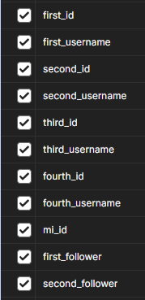
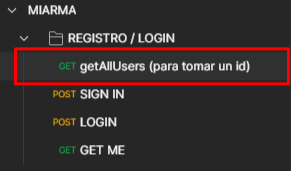
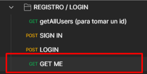
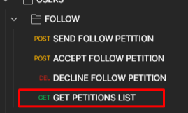
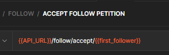
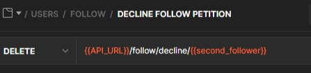
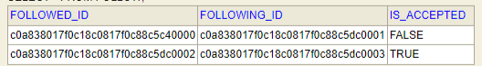
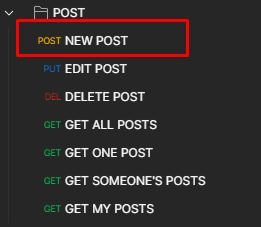
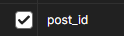

##### Autor: Manuel Expósito Herrera
# ProyectoMIARMA

## Red Social para Sevillanos

#### En esta aplicación cuyo “parecido con instagram es pura coincidencia”, se han desarrollado una serie de funcionalidades para este primer “sprint”. Estas son las distintas tareas que puede realizar mi aplicación:

---------

| Petición | Ruta |
| ------ | ------ |
| LOGIN | /auth/login
| SIGN IN | /auth/register |
| GET ME | /me
| NEW POST | /post |
| EDIT POST | /post/{post_id} |
| DELETE POST | /post/{post_id} |
| GET ALL POSTS | /post/public
| GET ONE POST | /post/{post_id} |
| GET MY POSTS | /post/me |
| SEND FOLLOW PETITION | /follow/{username}
| ACCEPT FOLLOW PETITION | /follow/accept/{id} |
| DECLINE FOLLOW PETITION | /follow/decline/{id} |
| GET PETITIONS LIST | /follow/list
| GET ONE USER PROFILE | /profile/{id} |
| EDIT MY PROFILE | /profile/me |

-------

**Tareas a futuro** que se quedaron pendientes:

- Localizar los mensajes de error para que puedan ser fácilmente traducidos a cualquier idioma.

- Implementar Comentarios, “Likes”, y la posibilidad de dejar de seguir a alguien.

- Poder subir vídeos en posts con su respectiva escalada, quizás también probar con audios.

- Dar un avatar predeterminado a aquellos usuarios que no suban una imagen al registrarse.

**Problemas por solucionar a futuro**:

- Temas de seguridad que perfilar: Los usuarios que siguen a perfiles privados, a pesar de eso, no pueden visualizar sus publicaciones. 

- Un seguidor es capaz de seguirse a sí mismo, a pesar de que se ha implementado la respectiva Excepción para evitar esto.

- El validador de la StrongPassword no funciona correctamente.

Para una corrección más rápida, se han implementado una serie de variables en la Colección de Postman: 

Para poder utilizar estas variables, primero debemos realizar una serie de peticiones, las cuales serán descritas a continuación.

----
## FOLLOW

Las variables de _first_id, first_username, second_id…_ serán completadas con los valores que traeremos gracias a una petición creada específicamente para ello: _/allUsers_, la cual encontraremos fácilmente en la primera carpeta de **“REGISTRO/LOGIN”** en Postman.

Las variables corresponden a los siguientes usuarios mock:

	FIRST → nerevelaz1982 / nere1982@gmail.com (cuenta pública)
	SECOND → ismavalxXx / ismaval@gmail.com (cuenta privada)
	THIRD→ darive74 / dariorive@gmail.com (cuenta privada)
	FOURTH → cafaco85 / carlotafariascorrea@gmail.com (cuenta pública)

Tras esto, ya podremos usar estas variables en las peticiones que requiera un username. De manera predeterminada, está el id del primer usuario, pero se podría cambiar con cualquiera, teniendo en cuenta a quién corresponde cada posición.

Para la variable _{{mi_id}}_, debemos primero realizar la petición **“GET ME”**, y así guardará el id del usuario loggeado.
	

En cuanto a las relaciones de seguimiento, contamos con dos variables:
**{{first_follower}}**
**{{second_follower}}**

Para darle un valor a estas variables, debemos cumplir varias condiciones primero:
1. El usuario que utilicemos debe tener follows sin aceptar, es decir, cuyo atributo “isAccepted” sea falso.

2. Tras asegurarnos de esto, debemos seleccionar la petición de GET PETITIONS LIST. El usuario que hizo la primera petición se guardará en “first_follower”, y si otro usuario hizo también una petición, se guardará en “second_follower”. Se ha organizado de esta forma para que pueda comprobarse la funcionalidad rápidamente de las peticiones para ACEPTAR y RECHAZAR.

La relación establecida funciona de la siguiente manera:

- Cuando un usuario envía una petición, se crea el objeto “Follow” que los relaciona.

- Si el atributo “is_accepted” es false, quiere decir que la petición está aún por confirmar, si es true, quiere decir que la petición ha sido aceptada y ahora el usuario que envió la petición puede oficialmente seguir al usuario.

- Si la petición es rechazada, esta relación “Follow” será eliminada de la base de datos.

-----
## POST

Para las publicaciones, se ha preparado una variable para guardar el id de la primera publicación que sea creada en la petición **NEW POST**.

Esta variable será usada en todas aquellas peticiones que requieran el id de una publicación, y así se sobreescribirá cada vez que creemos una nueva publicación, así que hay que tener eso en cuenta.

En cuanto al fichero, se aceptan los formatos: "png", "jpg", "jpeg" , "avi" y "mp4". Cualquier otra extensión lanzará un error de tipo WrongFormatException. Para probar esto último, se puede usar el fichero gato_svg.svg que se encuentra en la ruta [.../miarma/src/main/resources/mock_images](https://github.com/manuelexposito/ProyectoMIARMA/tree/main/miarma/src/main/resources/mock_images), donde pueden encontrarse más imagenes de prueba. 

En cuanto a los json, disponemos de varios ejemplos en la ruta [.../miarma/src/main/resources/jsons](https://github.com/manuelexposito/ProyectoMIARMA/tree/main/miarma/src/main/resources/jsons):
edit_post → Para la petición EDIT POST
edit_profile → Para la petición EDIT MY PROFILE
new_post → Para la petición NEW POST
sign_in → Para la petición de SIGN IN

El resto de peticiones son autoexplicativas. 

----

## REGISTRO / LOGIN / USERS

En mi aplicación, he permitido que los usuarios puedan registrarse sin avatar, pero debería tener una imagen predeterminada, la cual se planea establecer en un futuro.

La contraseña tiene validación, pero no funciona como debería. En cualquier caso, los requisitos que debería cumplir son:
- Tener mayúsculas y minúsculas
- Tener números
- Tener carácteres especiales
- Mínimo 8 carácteres y máximo 120

